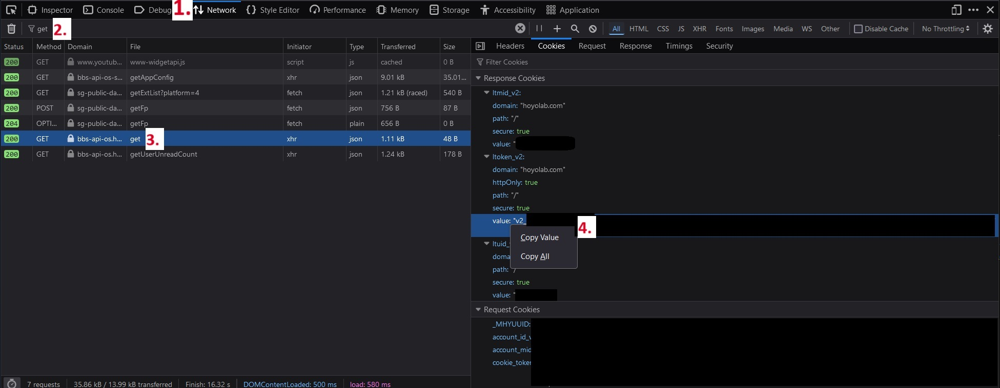

# hoyolab-check-in-helm
A Helm chart for deploying a Kubernetes cronjob that collects Hoyoverse games daily check in reward.

## Usage

1. Obtain Hoyolab Credentials from Cookies:
    - Open a Web Browser and log in to [HoYoLAB](https://www.hoyolab.com/)
    - Go to your home page at: https://www.hoyolab.com/home
    - Open the developer tools using `F12`.
    - Click on the `Network` tab.
    - Refresh the page.
    - Search the filter for `get`
    - Click on `get` File.
    - Go to the "Cookies" tab.
    - Copy the "ltoken_v2" cookie value.
    - Copy the "ltuid_v2" cookie value.

    

2. Create a `values.yaml` file containing the following:

```
config:
  check_in:
    genshin_impact: false
    honkai_star_rail : false
    honkai_impact_3rd: false
    tears_if_themis: false
    zenless_zone_zero: false
  hoyolab_credential:
    ltoken_v2: ""
    ltuid_v2: ""
  discord_webhook:
    enabled: false 
    webhook: ""
```
| Variable             | Description                                                                                                                                                       | Optional |
| -------------------- | ----------------------------------------------------------------------------------------------------------------------------------------------------------------- | -------- |
| check_in             | Select which game to check in. Multiple check in allowed from the same account.                                                                                   | No       |
| hoyolab_credential   | Obtained from Step 1                                                                                                                                              | No       | 
| discord_webhook      | Enable Discord Webhook. See Discord documentation on webhook here: [Intro to Webhook](https://support.discord.com/hc/en-us/articles/228383668-Intro-to-Webhooks)  | No       |

2. Add helm chart:

```
helm repo add dqle https://dqle.io/helm-charts/
helm repo update
```

3. Install helm chart:
```
helm install hoyolab-check-in dqle/hoyolab-check-in -f values.yaml -n hoyolab-check-in --create-namespace
```